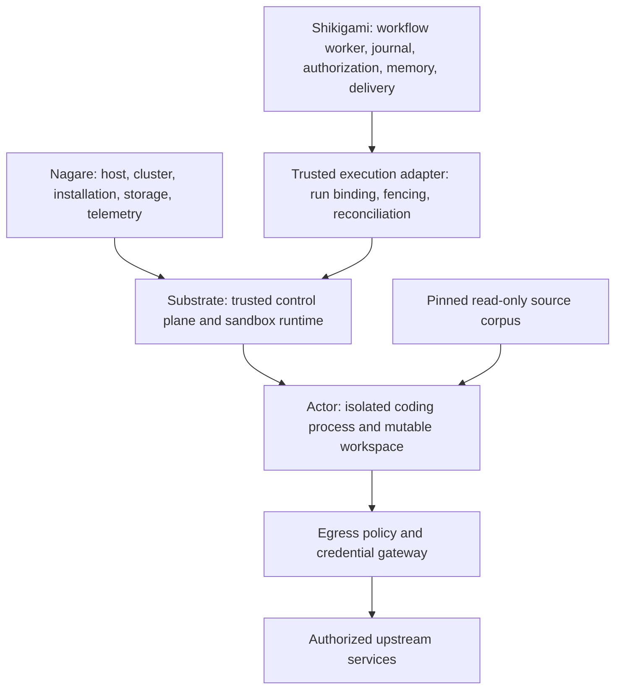

# Agent Substrate on Nagare as an execution platform for Shikigami

Canonical record: `mori://shinzui/nagare/okf/research/concepts/RES-5`.

## Conclusion and proposed direction

**Nagare is a plausible host for Agent Substrate, and the combination could become a strong
execution platform for Shikigami's coding and tool workloads.** Supporting it requires a platform
extension, a Shikigami execution adapter, and operational qualification. Increasing the minimum
machine size is useful and acceptable for this research, but does not close the integration gaps.

Recommend an opt-in **agent host profile starting at 8 vCPUs and 32 GiB RAM**, with gVisor as the
first backend. Use an Intel N2 machine if microVM support is a near-term objective; E2 remains a
candidate for gVisor-only deployments. Treat this as an initial qualification target, not an
experimentally established minimum. For substantial concurrent Haskell builds, qualify a
16-vCPU/64-GiB profile and retain a hard concurrency ceiling.

The useful product boundary is:

- Nagare provisions and operates the host, cluster, platform installation, storage, and telemetry.
- Substrate supplies sandbox isolation, actor placement, routing, and process/filesystem snapshots.
- Shikigami owns declared behavior, durable workflow progress, grants, exact-action authorization,
  memory, and delivery. A trusted adapter binds a run to its sandbox and reconciles lifecycle effects.



Substrate should initially host **execution workspaces**, while Shikigami's server, queue worker,
scheduler, and integration consumers remain ordinary supervised Nagare workloads. Suspending the
whole Shikigami worker would also suspend its queue lease renewal and workflow/database connections.
The worker currently renews visibility every ten seconds and cancels work on a renewal failure.
Keeping orchestration outside the actor avoids coupling that protocol to sandbox hibernation.
[^shikigami-runtime]

## Evidence boundary and method

This record completes a bounded source assessment. It does not certify that the deployment works.
**Observed** means a read-only command or static render was run; **source** means inspected code;
**proposal** means a design or sizing inference; **qualification** means a required future experiment.

Mori was consulted before reading dependencies: registry listing, searches for Substrate, Shikigami,
OKF profiles, k3s, Kubernetes, and gVisor, full Shikigami/profile records, and their documentation
catalogs. Substrate, k3s, and gVisor had no matching registered source project. Substrate was fetched
from its authoritative upstream and inspected at its released tag rather than treating cached
`main` documentation as a release contract. The intended canonical project identity is
`mori://agent-substrate/substrate`; artifact-level source URIs are pending, so the evidence register
pairs that identity with project-relative paths and immutable upstream links.

Observed release facts:

| Project | Inspected evidence | Meaning |
| --- | --- | --- |
| Substrate | GitHub release API reported stable `v0.3.0`, published `2026-09-30T23:40:12Z`; tag resolves to `ccecc788a327dc11dcd6c21ee153f3d0cbb5cc97` | Current release used for the assessment; still pre-1.0 |
| Nagare | Checkout HEAD `c3755ad70876f36cb1695967cc1a65360e5e1cd8` during inspection | Current implementation evidence, not a deployed-version claim |
| Shikigami | Checkout HEAD `9b5803d6d869e799d0674465254cbf076ae57236` during inspection | Current implementation and qualification-document evidence |
| k3s | GitHub release API reported `v1.37.1+k3s1`, published `2026-09-30T16:10:38Z` | Candidate qualification version; no Nagare pin was changed |

The upstream kind overlay rendered locally with kubectl 1.37.0:

```console
kubectl kustomize --load-restrictor LoadRestrictionsNone manifests/ate-install/kind
```

**Observed:** 44 objects, including seven Deployments and one DaemonSet. No cluster connection or
apply occurred. The default Kustomize load restriction first refused sibling file references;
the explicit unrestricted loader was used only on the trusted fetched checkout. Rendered bytes
had SHA-256 `244f65150539f579227ccb6670190721ef99ae5ee078315123f2e383b95bacf2`.
This is an overlay-render check, not a full installation: the installer separately handles CRDs,
the pod certificate controller, sandbox configuration, egress, and PostgreSQL. Images still need
release resolution; a rendered `ko://` reference is not a runnable production image. [^substrate-install]

## What is already compatible, and what is missing

| Concern | Existing Nagare foundation | Required addition or proof |
| --- | --- | --- |
| Compute and cluster | Rebuildable NixOS Compute Engine host, k3s, local k3d | Agent profile, newer cluster qualification, optional KVM |
| Workloads | Knative services, Deployment workers, tasks, typed configuration | Dedicated Substrate platform component and actor execution interface |
| Persistence | Durable data disk, managed databases, GCS/MinIO backup paths | Actor snapshot store and Substrate database recovery contract |
| Telemetry | OTLP collector and Victoria stack | Substrate endpoint configuration, scrapes, correlated run/actor diagnostics |
| Access | Nagare auth/ingress and application secrets | Trusted actor gateway, lifecycle authorizer, per-actor egress policy |
| Inventory | Reviewed lifecycle operations and ownership evidence | New kind semantics, Substrate control API adapter, delegated-child boundaries |
| Agent source access | UC-1 specifies a reproducible read-only filesystem corpus | Materialize a digest-pinned corpus image and resolve registry paths in actors |

The normal `Worker` model exposes image, command, replicas, env, resources, app volumes,
databases, brokers, and liveness. It does not express a DaemonSet, controller installation,
host devices, cluster certificate objects, or Substrate resources. Add a platform scope rather
than putting arbitrary host access into every app's configuration. See the
[worker model](../../cli/nagare-dsl/src/Nagare/Dsl/Worker.hs) and [current host flags](../../nixos/hosts/nagare-01/k3s.nix).

## Kubernetes and host requirements

### Cluster version and certificate APIs

The initial question's local Nagare pin is `rancher/k3s:v1.34.6-k3s1`. Substrate v0.3.0's
setup enables `ClusterTrustBundle`, `ClusterTrustBundleProjection`, `PodCertificateRequest`,
and `certificates.k8s.io/v1beta1`. Official Kubernetes documentation records the three features
as disabled beta features on 1.35–1.36 and enabled stable features on 1.37; PodCertificateRequest
was alpha on 1.34. **Do not assume that adding flags to Nagare's 1.34 pin makes this release compatible.**
[^substrate-host] [^kubernetes-certificates]

Qualify k3s `v1.37.1+k3s1` as the first fresh-cluster target, including the certificate API
versions actually served and used by the released pod certificate controller. A 1.36 target
with explicit gates is an alternative if the release's API assumptions require it. K3s exposes
component arguments, so configuration is expressible without replacing k3s. Verify API discovery,
certificate issuance, projection, rotation, and worker mTLS before starting an actor.
[^k3s-release] [^k3s-flags]

Also requalify Nagare's Knative/Kourier, cert-manager, CNI, admission, backup, and inventory proofs
on the chosen version. Cloud k3s follows the NixOS package input; local k3d has a separate image pin.
Specify both explicitly in release compatibility metadata. A new version being available does not
prove a supported migration from the existing three-minor-older installation.

### Runtime and filesystem shape

Substrate runs its sandbox runtime through `ateom` inside worker pods. Its architecture does not
require converting every Nagare application to a gVisor Kubernetes RuntimeClass. Sandbox assets
come through `SandboxConfig` and must be pinned along with worker images. [^substrate-architecture]

Adapt these upstream assumptions deliberately:

- `atelet` and workers share `/var/lib/ate`. Put its cache, actor working data, and local checkpoints
  on a durable, capacity-controlled disk, for example through a declarative mount under Nagare's
  data layout. Keeping the upstream path as a mount avoids an unnecessary source fork.
- Discover the real kubelet plugin and device-plugin paths on the selected k3s build. Upstream
  defaults reference `/var/lib/kubelet`; verify the device-registration socket, not just directory existence.
- Replace GKE's credential-provider mounts (`/home/kubernetes/bin` and
  `/etc/srv/kubernetes/cri_auth_config.yaml`). Nagare's Kubernetes image-pull Secret does not
  automatically authorize `atelet`'s independent OCI image downloads.
- Reproduce and validate the networking prerequisites, including proxy ARP and the actor tunnel,
  against Flannel/kube-router rather than assuming the kind demonstration proves k3s compatibility.
- Check host ports 8085 and 9090 for conflicts and retain an explicit firewall boundary.

The kind overlay already removes GKE credential-provider mounts and changes the object store;
it is useful adaptation evidence, but its public-registry assumptions and demonstration credentials
are not a production credential design. [^substrate-host] [^substrate-install]

### gVisor versus microVM

| Backend | Advantage for this adoption | Additional requirement |
| --- | --- | --- |
| gVisor | First qualification path; no KVM prerequisite | Prove actual agent binaries, syscall behavior, compiler/build tools, checkpoint/restore, and networking |
| microVM | Guest-kernel execution may suit broader coding environments; supports multiple durable directories | Intel-compatible nested virtualization, `/dev/kvm`, tun device, device plugin, guest assets, userfaultfd/demand-paging qualification |

Compute Engine explicitly excludes E2 from nested virtualization. MicroVM support therefore requires
a machine-family change, not only a larger E2 instance. Propose `n2-standard-8` and an explicit
Pulumi `enableNestedVirtualization` setting, followed by NixOS/KVM checks. Nagare's current instance
component has no nested-virtualization setting. Qualify NixOS on the supported machine family;
Google's KVM support alone is not evidence for the entire custom guest stack. [^gce-nested] [^nagare-infra]

Released worker pods explicitly set `privileged: false`, but run as root with capabilities including
`SYS_ADMIN`, `NET_ADMIN`, and `SYS_PTRACE`, and unconfined AppArmor/seccomp profiles. These are
trusted runtime components with substantial host authority. The actor sandbox is the isolation
boundary; an ordinary restricted app-pod policy cannot describe the runtime supervisor.
Confine exceptions to dedicated platform namespaces and prove that an actor receives no host mount,
device, Kubernetes admin token, or supervisor credential. [^substrate-worker-security]

## Sizing an agent host

The accepted product direction is to raise the minimum for this agent profile. Existing small-PaaS
defaults should not be represented as adequate for simultaneous platform control planes and builds.

**Proposed starting profiles, unmeasured:**

| Profile | Host | Initial workload envelope | Disk starting point |
| --- | --- | --- | --- |
| Development proof | 4 vCPUs / 16 GiB | One small actor, tuned installation, no heavy builds | 80–100 GiB boot; 100–200 GiB data |
| Agent profile minimum to qualify | 8 vCPUs / 32 GiB; E2 for gVisor-only or N2 for KVM | Two active coding runs, initially 2 vCPUs / 4 GiB each | 100 GiB boot; 300 GiB data, with explicit subdivisions/quotas |
| Haskell/build profile | 16 vCPUs / 64 GiB, N2 if KVM | Start with four runs at 2 vCPUs / 8 GiB each; adjust from measurements | 150 GiB boot; 500 GiB or more data according to corpus/cache size |

These numbers are admission hypotheses, not throughput promises. The 4-vCPU profile is a disposable
proof environment, not the proposed supported minimum. N2 standard shapes provide the stated
CPU/memory dimensions. A separate corpus/cache disk is desirable when its bulk or churn competes
with the database and snapshots. Boot sizing must include container images as well as the OS.
[^gce-shapes] [^nagare-corpus]

For 32 GiB, provisionally reserve about 8 GiB for host/platform/application control components,
about 8 GiB for runtime overhead, page cache and checkpoint peaks, and 16 GiB for active work.
Admission must satisfy both CPU and memory budgets:

```text
active runs <= min(
  floor((allocatable CPU - reserved CPU) / per-run CPU),
  floor((allocatable RAM - reserved RAM - measured snapshot headroom) / per-run RAM)
)
```

Set worker-pod requests/limits and ActorTemplate resource limits together. Substrate treats a
missing worker CPU or memory limit as unconstrained for placement, so omitting limits defeats the
intended capacity contract. Bound active run count, disk growth, and snapshot concurrency separately.
Many suspended actors can still consume substantial object storage. [^substrate-pools]

Upstream's base PostgreSQL manifest requests 2 CPUs and 1 GiB RAM, limits memory to 2 GiB,
and asks for a 500-GiB PVC. Its kind overlay reduces CPU/storage. Therefore the installation needs
an explicit small-platform database profile or a compatible external database; blindly installing
base defaults is inappropriate even after increasing the machine size. Preserve its schema,
authentication, migration, and backup requirements when adapting it. [^substrate-install]

Measure actor boot/restore latency, suspend latency, peak RSS, page-cache pressure, disk high-water,
snapshot bytes and bandwidth, concurrent compiler memory, OOM handling, and control-plane latency.
Substrate's advertised density and sub-second behavior are not predictions for one Nagare host.
Size to the actual Shikigami behavior and codebase, not actor-count marketing.

## Storage, source corpus, and build environments

Use a dedicated GCS snapshot bucket in cloud mode and an isolated S3-compatible bucket in local
mode. Substrate's release contains both backend paths; qualify Nagare's MinIO endpoint rather than
adding a second demonstration object store. Grant only the needed snapshot operations through an
explicit credential path. A GCE node identity and GKE Workload Identity are different mechanisms;
do not copy the GKE bootstrap IAM recipe as if it supplied per-pod identity on Nagare.
[^substrate-architecture] [^substrate-install]

Maintain three recovery domains:

| State | Owner and recovery boundary |
| --- | --- |
| Shikigami workflow journals, queues, memory and delivery receipts | Application databases and existing application recovery rules |
| Substrate actor/template/tag metadata and assignments | Substrate PostgreSQL store, schema/version migration, coordinated backup |
| Actor external checkpoints plus node-local working data | Object store and Substrate lifecycle; local pause checkpoints alone are not disaster recovery |

Restoring PostgreSQL from an older backup while snapshot garbage collection has deleted the objects
it referenced is a real consistency hazard. Define an application-consistent checkpoint/backup
procedure, retention or backup copies sufficient for the chosen recovery window, orphan detection,
and a database-plus-bucket restore trial. Snapshot tags have explicit ownership and deletion
semantics; they are not a substitute for a coordinated backup policy. [^substrate-api] [^substrate-upgrade]

For the first governed workspace, put repository checkout and mutable tool state in one `DurableDir`.
The gVisor template allows one such directory; microVM allows several. `Full` checkpoints capture
process memory, writable rootfs and durable data. `Data` checkpoints omit process memory and rootfs
changes. Select scope explicitly; a data-only restore cannot promise a resumed CLI process.
[^substrate-pools] [^substrate-api]

**A useful released capability is read-only OCI image volumes.** The protocol requires a digest,
and the image-cache implementation mounts their contents read-only. This suggests a simpler first
implementation of [UC-1](../use-cases/001-agents-read-the-registered-corpus-on-nagare.md): build a
corpus image from canonical project identities and exact revisions, mount it read-only, and configure
Mori's in-actor paths. Build a new digest when refreshing the corpus and create/version templates
accordingly; changing the image invalidates snapshots. This is a proposal to test, not a shipped
Mori registry-relocation solution. [^substrate-api] [^substrate-volumes]

Substrate's external CSI volumes are provisioned through its own network CSI-controller interface;
they are not ordinary Nagare app PVCs. Nagare's local-path provisioner cannot simply be assumed to
satisfy that interface. Start without CSI; add it only for a concrete shared-volume requirement.
Avoid a shared writable Git checkout across actors. External-volume contents are outside actor
snapshots, so reverting memory/rootfs does not revert those volumes; adding CSI also adds a separate
consistency and backup problem. [^substrate-volumes] [^substrate-pools]

Package the Linux agent/toolchain and required Nix closures into immutable OCI assets. Qualification
must exercise the actual Shikigami and Baikai binaries, certificates, Git, compiler, and validation
commands. This research does not require container execution to traverse the host's Nix store.
Nagare's [prebuilt-closure use case](../use-cases/002-deliver-prebuilt-nix-closures-to-nagare-jobs.md)
is relevant, but actor cache access and in-sandbox Nix/build behavior need separate proof; Job
configuration does not automatically apply to actors.

## Ingress, egress, credentials, and authorization

Keep Substrate control APIs and the actor router private initially. A trusted Shikigami execution
gateway should resolve an authenticated run to its allowed actor and set `ate-target-actor` itself.
An external caller must not select any actor by supplying that header. The router then activates and
tunnels to the actor. Use a dedicated routed service or Nagare gateway integration; Knative's
scale-to-zero service behavior does not manage Substrate actor suspension. [^substrate-architecture]

Source inspection refines an important upstream documentation gap: v0.3.0 includes experimental
OpenFGA authorization, disabled by default, whose registry covers only Create/List/Get/Delete
Atespace. Unregistered RPCs pass through the interceptor. Thus enabling the experiment does not
provide complete actor lifecycle or tenant authorization. The older authentication document's
blanket statement that authorization is absent is also incomplete. Treat the control plane as a
trusted service boundary and enforce Shikigami's exact-action checks in its adapter.
[^substrate-authz]

An Atespace is a Substrate identity/management grouping, not automatically a Kubernetes namespace
or a complete tenant isolation guarantee. Do not hand sandbox actors the adapter's broad control
credential. Map run, principal, repository, template, actor UID, and allowed operations explicitly.

The released egress path tunnels actor TCP connections through a policy enforcement point, with a
destination-port-53 DNS exception; other protocols are blocked in the described contract. Qualify
DNS, model streaming, HTTP API access, Git HTTPS/SSH, package caches, and required cluster services.
Apply network policy around worker pools and the gateway, including metadata-service blocking and
DNS restrictions; the DNS exception must not become an unintended route to other port-53 services.
[^substrate-egress]

Prefer gateway-side credential injection for approved HTTPS APIs. It can replace a placeholder
header without placing the key in actor memory or files. In v0.3.0 it is experimental, requires
MITM trust configuration, and needs the credential provider enabled. With no provider configured,
injection is skipped; with an attempted lookup, credential failure denies the request. Test these
exact states and negative paths. This mechanism does not automatically solve SSH keys, vendor CLI
login stores, or arbitrary process authentication. [^substrate-egress]

Full snapshots can retain secrets and login material already present in memory or the filesystem.
Keep broad credentials and authorization proof caches outside actors; refresh authority after resume.
Golden/template snapshots must contain no per-run principal, token, or private repository state.
An actor identity or short-lived TLS certificate authenticates a sandbox; it is not a Shikigami
grant to execute every tool. Inspect snapshot access, deletion, and encryption as part of the
actual threat boundary.

## Shikigami integration contract

The strongest use case is governed coding workspaces, described by
`mori://shinzui/shikigami/okf/improvement-requests/concepts/IR-11`. That request remains proposed:
durable-worker workspace mutation is not delivered merely because foreground CLI launch exists.
The current qualification report also leaves production unproven and records a cancellation problem
in released background CLI adapters. Substrate can add confinement but does not by itself repair
those adapter semantics or qualify Shikigami's other integration services. [^shikigami-qualification]

Propose a trusted execution adapter with these responsibilities:

| Responsibility | Required behavior |
| --- | --- |
| Workspace admission | Resolve canonical project and immutable base revision from an operator allowlist; no caller-selected host path |
| Stable binding | Record run ID, principal, actor name **and UID**, template UID/version, sandbox asset digests, corpus digest, and lifecycle epoch |
| Replay | Create once or reconcile a lost acknowledgement by observing identity; reject an existing same-name actor with incompatible ownership |
| Commands | Expose bounded read/edit/validate/Git operations with fresh exact authorization; no ambient Nagare admin shell |
| Cancellation | Fence new actions, terminate all process descendants, reconcile uncertain termination, and publish one bounded terminal result |
| Output | Return change/commit and validation evidence to Shikigami's durable journal and authorized delivery path; redact credentials |
| Retention | Suspend reusable workspaces only at approved safe points; collect terminal/orphaned actors without deleting active-run state |

Implement through the released protobuf/gRPC interface or a small typed bridge owned by the
integration. A CLI can prove the spike, but production must preserve machine-readable identity,
timeouts, mTLS/JWT, status reconciliation, and error classes. This research does not select a
Haskell gRPC library or dependency bounds; that choice requires Mori and registry inspection.
[^substrate-api]

**There are two different kinds of durability.** Keiro/Shikigami journaled replay controls application
effects; Substrate snapshots preserve process and filesystem state. A full snapshot does not
transactionally roll back a Git push, an API request, a workflow row, or a sink receipt. Bind both
layers through operation IDs and epochs, and reconcile ambiguous external effects rather than
reissuing them. The lifecycle RPC request shapes are not a generic exactly-once request protocol.

Do not automatically suspend a CLI while it waits on an external model request. Preserving local
socket/process state is not proof that the remote service, transport deadline, credential, or queue
lease survives. Initially suspend only an idle workspace after commands have quiesced and results
have been durably accepted. Later qualify cooperative pause/resume with explicit workload hooks.
Shikigami can already wait durably for approvals without keeping an actor active.

For revocation, the trusted gateway/adapter must obtain a fresh decision before each protected
operation. Putting a vendor CLI with unrestricted file/shell tools inside a sandbox does not
automatically enforce that rule. Decide which local mutations can be admitted as one bounded
execution capability, which tools must pass through a mediated per-action service, and which remote
effects remain sinks outside the sandbox. This policy mapping is a Shikigami-owned design gate.
[^shikigami-runtime]

## Nagare ownership and operating model

Add a typed platform declaration for Substrate's enablement, version/digests, namespace,
host paths, store configuration, backend, pool budgets, credentials, telemetry, and exposed routes.
Provide bootstrap/status/diagnostics, then lifecycle-aware upgrade and collection. Command names
are intentionally not chosen here; this is research, not an ExecPlan or an API commitment.

Inventory needs substantive work. Its current conditional-update kind table excludes DaemonSet,
Substrate CRs, Node labels, and certificate trust objects; readiness handling likewise does not
prove Substrate readiness. A generic successful apply does not prove certificate issuance, worker
registration, actor resumption, or drain completion. Add kind-specific conditional mutation and
recovery evidence before calling the platform installation supported. [^nagare-inventory]

Maintain ownership boundaries:

- Nagare owns pinned installation manifests and its declared WorkerPools/SandboxConfigs.
- Substrate's controller owns the worker Deployments/Pods it derives. Nagare observes them and
  records their delegated relationship; it must not independently rewrite controller-owned fields.
- Substrate owns high-frequency actor state in its database. Avoid turning every actor transition
  into a platform inventory transaction; a typed execution adapter owns the application boundary.
- Certificate controllers own generated certificates/trust state according to their actual
  lifecycle; distinguish installation ownership from generated runtime material.

Use Nagare's OTLP collector and Victoria stack instead of deploying upstream demonstration
Prometheus/collector stacks by default. Configure the released `ate-otel-config` endpoint, scrape
supported metrics, and correlate run ID, actor UID, pool and snapshot identity without logging
secrets. Keep resource bounds and retention explicit.

The released upgrade runbook drains actors, coordinates old/new worker versions, and flips node
version labels. **On a single-node cluster the dataplane transition stops the entire actor service.**
Nagare must expose that maintenance window and finish durable checkpoints before changing the host.
Pod rollout success is insufficient. Test interruption/recovery of the procedure, unsupported
snapshot-runtime compatibility, database migration rollback limits, and terminal cleanup.
[^substrate-upgrade]

Sudden node loss remains a separate case: running or locally paused state may be lost since its
last external checkpoint. Reverting a crashed actor can recover the previous checkpoint but does
not preserve uncheckpointed work or undo external effects. State the accepted RPO and recreate the
host from immutable configuration. A larger single node remains a single failure domain.

## Alternatives and adoption decision

| Approach | Best fit | Tradeoff |
| --- | --- | --- |
| Ordinary Nagare workers/Jobs | Stateless or short bounded agent runs | Simplest execution model; no process-memory hibernation or Substrate actor multiplexing |
| Substrate installed on Nagare, gVisor first | Repeated coding sessions and tool workspaces with long idle periods | Requires host adaptation and lifecycle/recovery integration, but preserves Nagare's single-node model |
| Substrate on Nagare with microVMs | Workloads requiring a guest kernel or failing gVisor compatibility | Machine-family/KVM change, more assets and qualification |
| Separate upstream-oriented cluster | Larger fleet, hardware separation or stronger availability requirements | Greater operational footprint; Nagare/Shikigami still need the execution adapter |

Recommend the second approach for the first proof, while choosing N2 hardware if avoiding a later
microVM host replacement is worth the cost. Do not require microVMs before demonstrating the real
Shikigami workload. Conversely, do not declare gVisor adequate merely because a counter demo works.

## Qualification work needed before support can be claimed

These are work packages and acceptance evidence, not implementation authorization for live cloud
changes or a schedule estimate.

| Gate | Required evidence | Primary owner |
| --- | --- | --- |
| Q1: Fresh cluster | Pinned cluster APIs, certificate issuance/rotation, platform regression passes, immutable install render/image resolution | Nagare |
| Q2: Host/runtime | Correct mount and credential-provider paths, private OCI downloads, tunnel/CNI tests, negative host-access tests | Nagare/Substrate integration |
| Q3: Actor lifecycle | Real Linux agent writes memory/filesystem state; Full suspend and restore survive worker replacement; saturation, OOM and crashed actor behavior recorded | Integration |
| Q4: Storage recovery | Dedicated store credentials, checkpoint/GC policy, coordinated database/bucket backup, isolated rebuild and restore | Nagare |
| Q5: Governed run | Real Shikigami addressed run, canonical fixture repository, authorization allow/deny, isolated editing/validation, one bounded terminal result | Shikigami |
| Q6: Failure/replay | Lost create acknowledgement, duplicate delivery, adapter restart, cancellation during validation, stale epoch, revocation after resume; no duplicate commit or sink effect | Shikigami/integration |
| Q7: Capacity | 8/32 profile measured with selected CLI and build workload; peak snapshot memory/disk, latency and hard concurrency admission | Nagare |
| Q8: Operations | Drain/upgrade interruption, maintenance window, previous checkpoint recovery after node loss, orphan cleanup and documented restore RPO/RTO | Nagare/integration |
| Q9: Optional microVM | Supported N2/NixOS/KVM path; actual tools, guest snapshot restore, devices and resource ceilings | Nagare |

First proof: use one trusted fixture actor with no production credentials, one approved repository,
a digest-pinned tool image/corpus, one durable workspace, and one active run. Verify an edit and
validation result across a completed Full suspend/restore. Then inject lost acknowledgements and
worker failure before broadening capabilities or concurrency. Measure the meaningful full workflow,
including authorization, image/corpus preparation, warm and cold restore, validation, and delivery.

The decision becomes favorable if the selected agent/toolchain works under the sandbox, controlled
resume/retention materially improves repeated sessions, and recovery stays comprehensible on one
node. Prefer ordinary worker/Job execution if these workloads are mostly short-lived, cannot pause
safely, or snapshot/cold-cache overhead dominates. This is the evidence needed to decide whether
Nagare becomes the preferred platform for Shikigami rather than merely an environment that can boot it.

## Evidence register and reproduction

All Substrate source links below refer to `mori://agent-substrate/substrate` at
`ccecc788a327dc11dcd6c21ee153f3d0cbb5cc97` (`v0.3.0`). Source-file artifact URIs are pending;
the link label is its project-relative path. All Shikigami paths refer to `mori://shinzui/shikigami`
at the inspected checkout revision; its source/document artifact URIs are pending unless a specific
OKF URI is given. These project identities remain part of the durable reference even when registry
resolution is absent.

[^substrate-release]: [v0.3.0 release](https://github.com/agent-substrate/substrate/releases/tag/v0.3.0).
[^substrate-architecture]: [docs/architecture.md](https://github.com/agent-substrate/substrate/blob/v0.3.0/docs/architecture.md).
[^substrate-api]: [pkg/proto/ateapipb/ateapi.proto](https://github.com/agent-substrate/substrate/blob/v0.3.0/pkg/proto/ateapipb/ateapi.proto).
[^substrate-pools]: [docs/api-guide.md](https://github.com/agent-substrate/substrate/blob/v0.3.0/docs/api-guide.md).
[^substrate-host]: [manifests/ate-install/atelet.yaml](https://github.com/agent-substrate/substrate/blob/v0.3.0/manifests/ate-install/atelet.yaml), [hack/create-kind-cluster.sh](https://github.com/agent-substrate/substrate/blob/v0.3.0/hack/create-kind-cluster.sh).
[^substrate-worker-security]: [cmd/atecontroller/internal/controllers/workerpool_apply.go](https://github.com/agent-substrate/substrate/blob/v0.3.0/cmd/atecontroller/internal/controllers/workerpool_apply.go).
[^substrate-authz]: [cmd/ateapi/main.go](https://github.com/agent-substrate/substrate/blob/v0.3.0/cmd/ateapi/main.go), [cmd/ateapi/internal/authz/registry.go](https://github.com/agent-substrate/substrate/blob/v0.3.0/cmd/ateapi/internal/authz/registry.go), [interceptor.go](https://github.com/agent-substrate/substrate/blob/v0.3.0/cmd/ateapi/internal/authz/interceptor.go).
[^substrate-egress]: [docs/network-egress.md](https://github.com/agent-substrate/substrate/blob/v0.3.0/docs/network-egress.md), [docs/egress-credential-injection.md](https://github.com/agent-substrate/substrate/blob/v0.3.0/docs/egress-credential-injection.md).
[^substrate-volumes]: [docs/csi-volumes.md](https://github.com/agent-substrate/substrate/blob/v0.3.0/docs/csi-volumes.md), [internal/imagecache/bundle_linux.go](https://github.com/agent-substrate/substrate/blob/v0.3.0/internal/imagecache/bundle_linux.go).
[^substrate-upgrade]: [docs/upgrade.md](https://github.com/agent-substrate/substrate/blob/v0.3.0/docs/upgrade.md).
[^substrate-install]: [manifests/ate-install/kind/kustomization.yaml](https://github.com/agent-substrate/substrate/blob/v0.3.0/manifests/ate-install/kind/kustomization.yaml), [base PostgreSQL](https://github.com/agent-substrate/substrate/blob/v0.3.0/manifests/ate-install/postgres/postgres.yaml), [kind PostgreSQL override](https://github.com/agent-substrate/substrate/blob/v0.3.0/manifests/ate-install/kind/postgres/kustomization.yaml), [hack/install-ate.sh](https://github.com/agent-substrate/substrate/blob/v0.3.0/hack/install-ate.sh).
[^nagare-host]: [k3s module](../../nixos/hosts/nagare-01/k3s.nix), [GCP host module](../../nixos/modules/gcp.nix), [storage](../../nixos/hosts/nagare-01/storage.nix).
[^nagare-infra]: [instance component](../../infra/pulumi/src/components/NagareInstance.ts), [VM shape](../../infra/pulumi/src/vmShape.ts).
[^nagare-local]: [local substrate pin](../../cluster/bootstrap/local-substrate.json).
[^nagare-inventory]: [kind table](../../cli/nagarectl/src/Nagare/Inventory/Adapters/KubernetesKinds.hs), [runtime adapter](../../cli/nagarectl/src/Nagare/Inventory/Adapters/KubernetesRuntime.hs), [RES-4](kubernetes-api-semantics-for-inventory-proofs.md).
[^nagare-corpus]: [UC-1](../use-cases/001-agents-read-the-registered-corpus-on-nagare.md).
[^shikigami-workspaces]: `mori://shinzui/shikigami/okf/improvement-requests/concepts/IR-11` (resolved with `mori path`).
[^shikigami-runtime]: `mori://shinzui/shikigami`, project-relative `README.md`, `docs/operations/action-authorization.md`, `shikigami-core/src/Shikigami/Agent/Workflow.hs`, and `shikigami-workers/src/Shikigami/Agent/RunJob/Worker.hs`; artifact-level URIs pending.
[^shikigami-qualification]: `mori://shinzui/shikigami`, project-relative `docs/evidence/local-qualification/readiness.md` and `docs/operations/baikai-execution.md`; artifact-level URIs pending.
[^kubernetes-certificates]: [feature gates](https://kubernetes.io/docs/reference/command-line-tools-reference/feature-gates/), [projected volumes](https://kubernetes.io/docs/concepts/storage/projected-volumes/).
[^k3s-release]: `mori://k3s-io/k3s`, [v1.37.1+k3s1 release](https://github.com/k3s-io/k3s/releases/tag/v1.37.1%2Bk3s1).
[^k3s-flags]: [server arguments](https://docs.k3s.io/cli/server), [configuration](https://docs.k3s.io/installation/configuration).
[^gce-nested]: [nested virtualization](https://docs.cloud.google.com/compute/docs/instances/nested-virtualization/overview).
[^gce-shapes]: [machine family dimensions](https://docs.cloud.google.com/compute/docs/general-purpose-machines).

Release facts are reproducible with `git ls-remote --tags` and GitHub's release API. The latter
resolved a stale browser-cache result for `/releases/latest` that still redirected to v0.1.0:

```console
git ls-remote --tags https://github.com/agent-substrate/substrate.git
gh api repos/agent-substrate/substrate/releases/latest
gh api repos/k3s-io/k3s/releases/latest
```

The assessment changes documentation only. Machine defaults, infrastructure, cluster pins,
application code, and live contexts were not changed.

Record checks: the research bundle passes profile-enforced, log-enforced validation (five concepts).
RES-5 and its linked RES-4 also pass strict profile/log validation in an isolated bundle. Strict
validation of the entire existing bundle still reports RES-3's missing recommended `reviews`
metadata; no review was invented for that earlier record. All relative Markdown links and source
footnote definitions in RES-5 were checked, the research graph parses, and `git diff --check` passes.
The new canonical Mori handle was attempted but is not yet resolvable from the current registry;
the repository file and bundle handle remain authoritative pending registry refresh.
